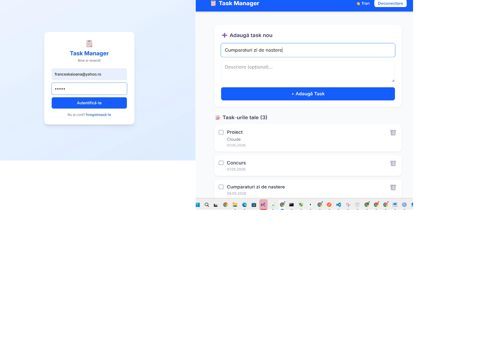

# Task Manager

**Nume:** Vartolomei Franceska Ioana
**Grupă:** 1147
**Link video:** https://youtu.be/p32Q_ga2ds0
**Link publicare:** https://cloude-computing.vercel.app
## 1. Introducere
Task Manager este o aplicație web pentru gestionarea task-urilor personale. 
Utilizatorii se pot înregistra, autentifica și gestiona task-uri. 
La înregistrarea unui task nou utilizatorii primesc un email de task nou adaugat cu numele rask ului prin SendGrid.
Tehnologii folosite: Next.js, MongoDB Atlas, SendGrid, NextAuth.js, Vercel.
git add .

## 2. Descriere problemă
Aplicația rezolvă problema organizării task-urilor zilnice. 
Utilizatorii pot adăuga task-uri, le pot marca ca finalizate sau șterge. 
Datele persistă în cloud și sunt accesibile de oriunde.

## 3. Descriere API

### Serviciu Cloud 1: MongoDB Atlas
- Tip: Bază de date NoSQL în cloud
- Utilizare: Stocarea utilizatorilor și task-urilor
- Autentificare: Connection string cu username/password

### Serviciu Cloud 2: SendGrid
- Tip: Serviciu de trimitere email prin API REST
- Utilizare: Email de inregistrare task nou 
- Autentificare: API Key

## 4. Flux de date

### Metode HTTP
- GET /api/tasks — obține lista de task-uri
- POST /api/tasks — creează task nou
- PUT /api/tasks — actualizează task
- DELETE /api/tasks — șterge task
- POST /api/auth/[...nextauth] — autentificare

### Exemplu request/response
POST /api/tasks
Request: { "title": "Task nou", "description": "Descriere" }
Response: { "_id": "664abc123", "title": "Task nou", "completed": false }

### Autentificare
- NextAuth.js cu JWT
- Parole criptate cu bcryptjs
- SendGrid cu API Key

## 5. Capturi ecran

## 6. Referințe
- https://nextjs.org/docs
- https://www.mongodb.com/atlas
- https://next-auth.js.org
- https://sendgrid.com/docs
- https://vercel.com/docs